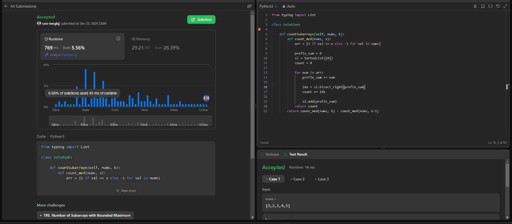
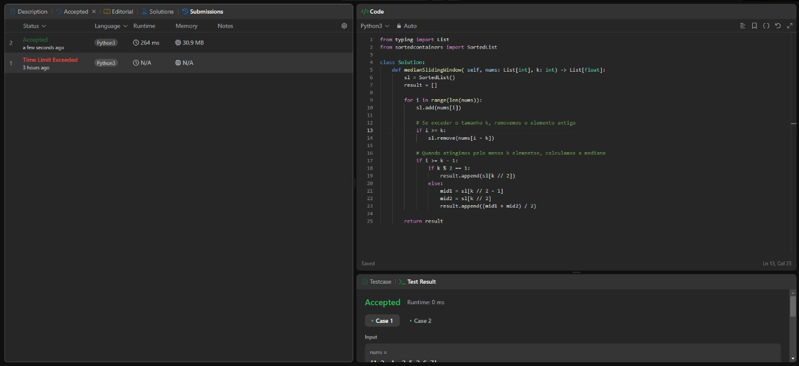

# Dividir e Conquistar - LeetCode - Dupla 56

**Número da Lista**: 3 
**Conteúdo da Disciplina**: Dividir e Conquistar 

## Alunos
|Matrícula | Aluno |
| -- | -- |
| 20/0015753  |  [Caio Berg Carlos Leite](https://github.com/Caio-bergbjj) |
| 20/0028154 |  [Thiago Ribeiro Freitas](https://github.com/thiagorfreitas) |

## Sobre 
Este projeto consiste na resolução de problemas de Dividir e Conquistar do LeetCode, para a disciplina de Projeto de Algoritmos, da Universidade de Brasília.

### Problemas

|Problema | Descrição | Dificuldade| Contribuidores
| -- | -- | -- | -- |
| 3193  |  [Count the Number of Inversions](https://leetcode.com/problems/count-the-number-of-inversions/)| Hard | [Thiago Freitas](https://github.com/thiagorfreitas) |
| 2488  |  [Count Subarrays With Median K](https://leetcode.com/problems/count-subarrays-with-median-k/description/)| Hard | [Thiago Freitas](https://github.com/thiagorfreitas) , [Caio Berg Carlos Leite](https://github.com/Caio-bergbjj) |
| 480  |  [Sliding Window Median ](https://leetcode.com/problems/sliding-window-median/description/)| Hard | [Caio Berg Carlos Leite](https://github.com/Caio-bergbjj) |

## Screenshots

### Count the Number of Inversions

### Count Subarrays With Median K

### Sliding Window Median

## Instalação 
**Linguagem**: Python 
para a utlização dos códigos será necessário utilizar o comando 'pip install sortedcontainers' para baixar a biblioteca.

